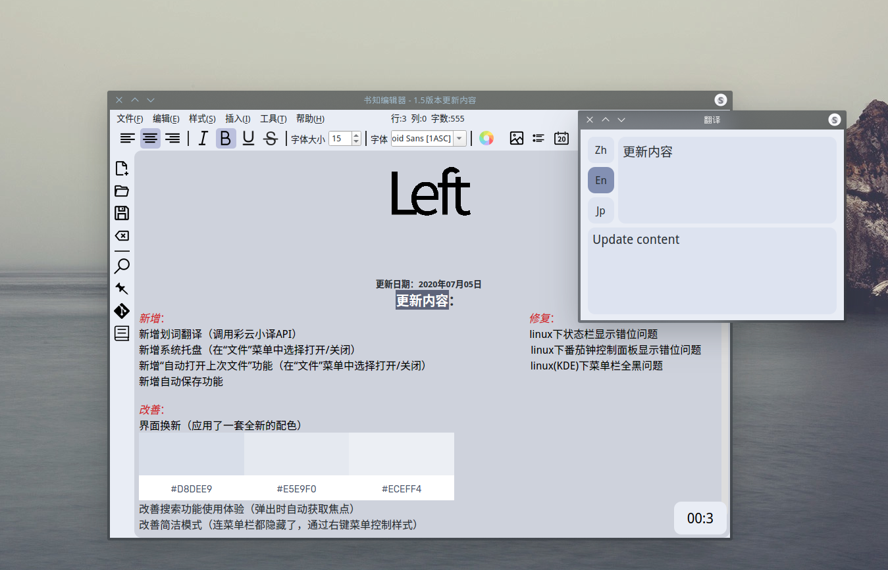

# SurZ 1.5
### 介绍

1.5来了！又是一个大版本更新！

### 特色功能

1、一个简单的定时器，帮你控制你的写作时间。

2、编辑器背景更换，选择最适合你的。

3、rtf格式编辑，所见即所得。

4、qt开发，跨平台。

5、界面好看。

**注：这次界面是真的好看！**

### 关于

软件开发者是初三的，界面设计者是初一的，网站搭建者是初二的。

整个初中集齐了啊！（笑）

[官网](https://left-studio.gitee.io "Left-Studio官网。")

[测试站点](https://leftstudio.tk  "官网的测试站点")

